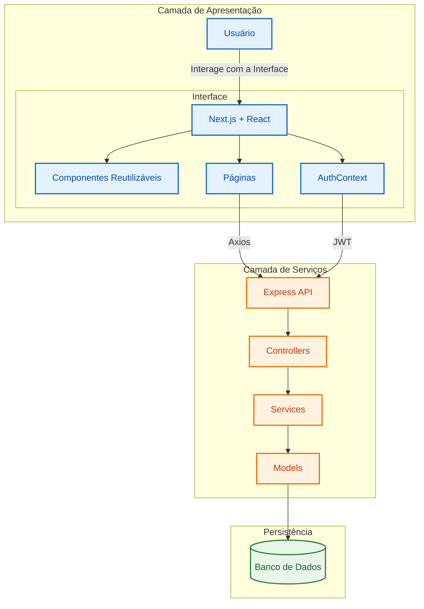

<div align="center">


# 📚 PROSA

**Projeto Full Stack desenvolvido para conectar pessoas através do compartilhamento de recomendações de livros, filmes e séries em uma plataforma social moderna e colaborativa.**

<p>
  
  
  
  
  
  
  
</p>

</div>

---

> [!NOTE]
> O **PROSA** é uma plataforma social desenvolvida para incentivar o compartilhamento de recomendações de livros, filmes e séries entre usuários.
>
> A proposta é criar uma comunidade colaborativa onde cada pessoa possa descobrir novos conteúdos, compartilhar suas indicações favoritas e organizar sua própria WatchList em um ambiente moderno, intuitivo e responsivo.

---

# 📑 Sumário

- [✨ Funcionalidades](#-funcionalidades)
- [🏗️ Arquitetura do Sistema](#️-arquitetura-do-sistema-visão-geral)
- [🛠 Tecnologias Utilizadas](#-tecnologias-utilizadas)
- [📁 Estrutura do Projeto](#-estrutura-do-projeto)
- [📄 Licença](#-licença)
- [👨‍💻 Autor](#-autor)

---

# ✨ Funcionalidades

O sistema disponibiliza os seguintes recursos:

- 🔐 Cadastro e autenticação de usuários utilizando JWT.
- 👤 Login seguro com senhas criptografadas utilizando bcrypt.
- 📚 Compartilhamento de recomendações de livros.
- 🎬 Compartilhamento de recomendações de filmes.
- 📺 Compartilhamento de recomendações de séries.
- ❤️ Organização de conteúdos em uma WatchList pessoal.
- 🌎 Área de comunidade para visualizar recomendações compartilhadas por outros usuários.
- 🔎 Navegação organizada por categorias.
- 📱 Interface totalmente responsiva.
- ⚡ Navegação otimizada utilizando Next.js e React.

---

# 🏗️ Arquitetura do Sistema (Visão Geral)

O sistema foi desenvolvido seguindo uma arquitetura **Full Stack**, promovendo uma separação completa entre a camada de apresentação (**Frontend**) e a camada de serviços (**Backend**). A comunicação entre ambas ocorre através de uma API REST protegida por autenticação baseada em **JSON Web Token (JWT)**.

Abaixo está a representação da arquitetura da aplicação.



---

# 🛠 Tecnologias Utilizadas

## Frontend

| Categoria | Tecnologia |
|-----------|------------|
| Framework | Next.js 16 |
| Biblioteca | React 19 |
| Estilização | Tailwind CSS 4 |
| Gerenciamento de Estado | Context API |
| Comunicação HTTP | Axios |

---

## Backend

| Categoria | Tecnologia |
|-----------|------------|
| Runtime | Node.js |
| Framework | Express 5 |
| Autenticação | JSON Web Token (JWT) |
| Criptografia | bcryptjs |
| Middleware | CORS |
| Configuração | dotenv |

---

## Arquitetura

| Camada | Tecnologia |
|---------|------------|
| Frontend | Next.js |
| Backend | Express.js |
| Comunicação | API REST |
| Autenticação | JWT |
| Estado Global | Context API |

---

# 📁 Estrutura do Projeto

```text
PROSA/
├── backend/
│   ├── src/
│   │   ├── controllers/
│   │   ├── middlewares/
│   │   ├── models/
│   │   ├── routes/
│   │   ├── services/
│   │   ├── utils/
│   │   └── server.js
│   │
│   ├── package.json
│   └── ...
│
├── frontend/
│   ├── app/
│   │   ├── cadastro/
│   │   ├── comunidade/
│   │   ├── indicacoes/
│   │   ├── login/
│   │   ├── watchlist/
│   │   └── layout.jsx
│   │
│   ├── components/
│   ├── context/
│   │   ├── AppContext/
│   │   └── AuthContext/
│   │
│   ├── services/
│   ├── public/
│   ├── package.json
│   └── ...
│
├── README.md
└── .gitignore
```

---

# 📄 Licença

Este projeto está licenciado sob a licença **ISC**.

Consulte o arquivo **LICENSE** para mais informações.

---

# 👨‍💻 Autor

**Silas Santos**

---
